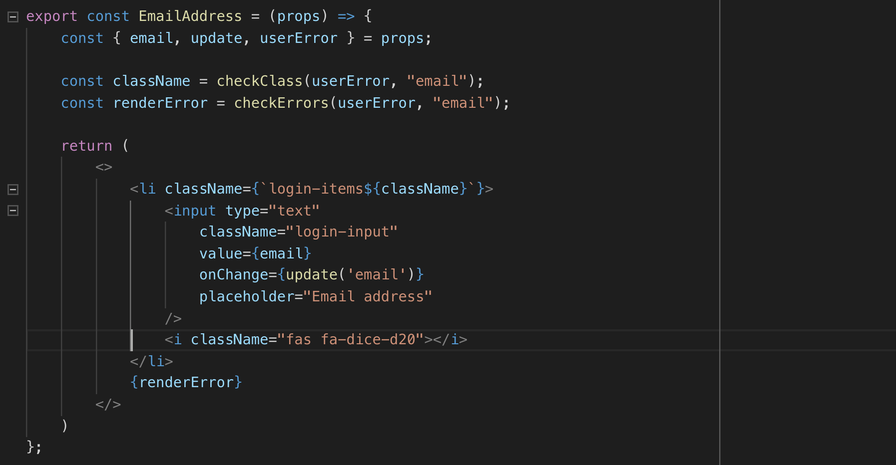
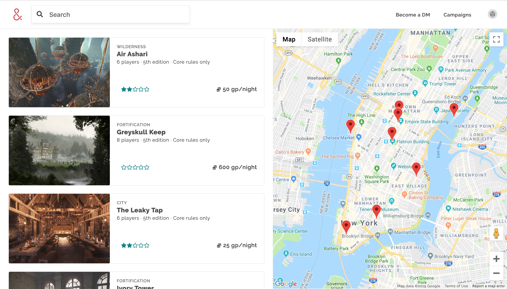
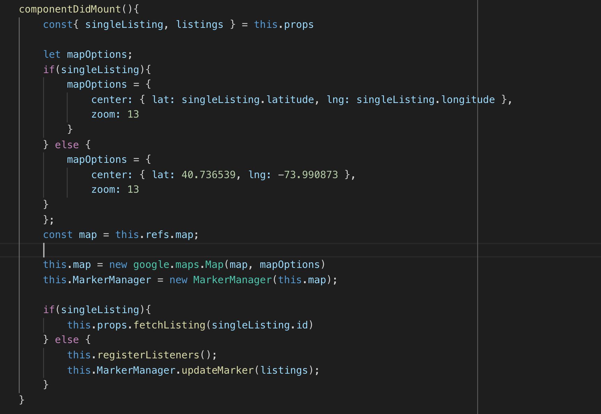
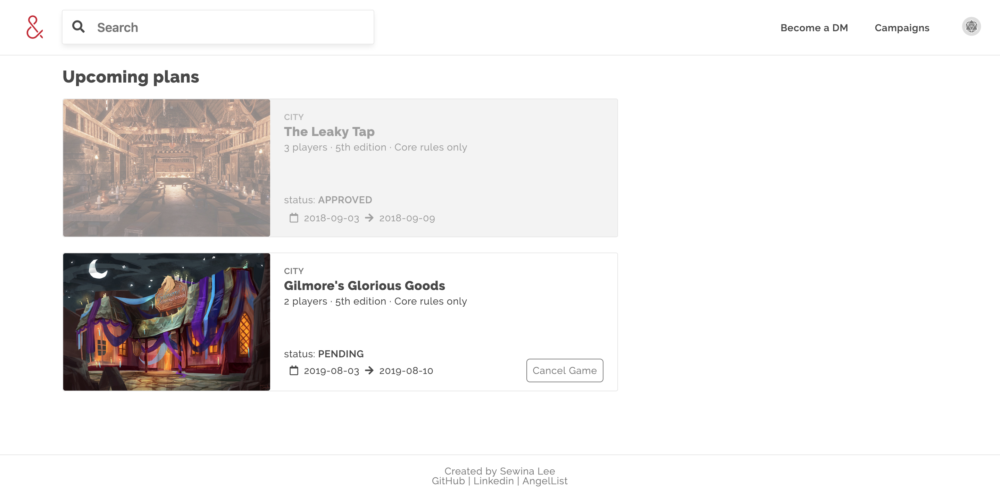

                Where D&D players can search and book campaigns in their area. 

[Live Demo](https://air-d-n-d.herokuapp.com/#/) | Inspired by AirBnB

## Technologies
* JavaScript
* React / Redux
* Ruby on Rails
* PostgreSQL
* CSS
* Webpack
* Amazon Web Services
* Google Map API

## Features
A few things you can do with Air D&D:
* User Authentication

    
* View all the local D&D campaigns in New York City
* Filter the search by map, campaign type, name, location

    
    
* View each campaign description, rules, and perks.
* Book a campaign of your choice. (required login to book.)
* View All Booked Campaigns

    
* Review and rate booked campaigns.

    

## Future Features
* Edit Bookings
* User Show Page
* Host Campaigns
* Save Campaigns
* Messaging
