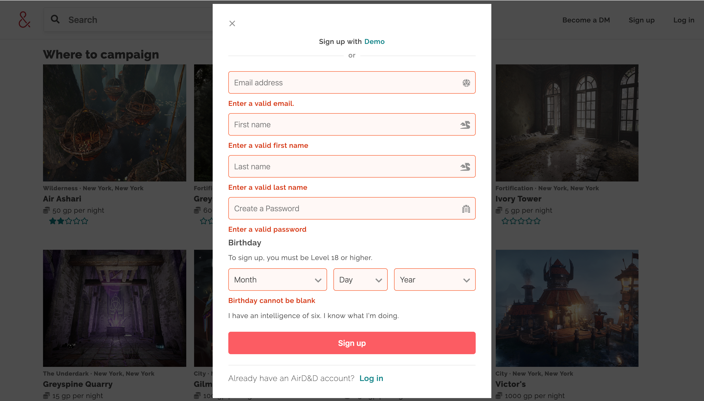
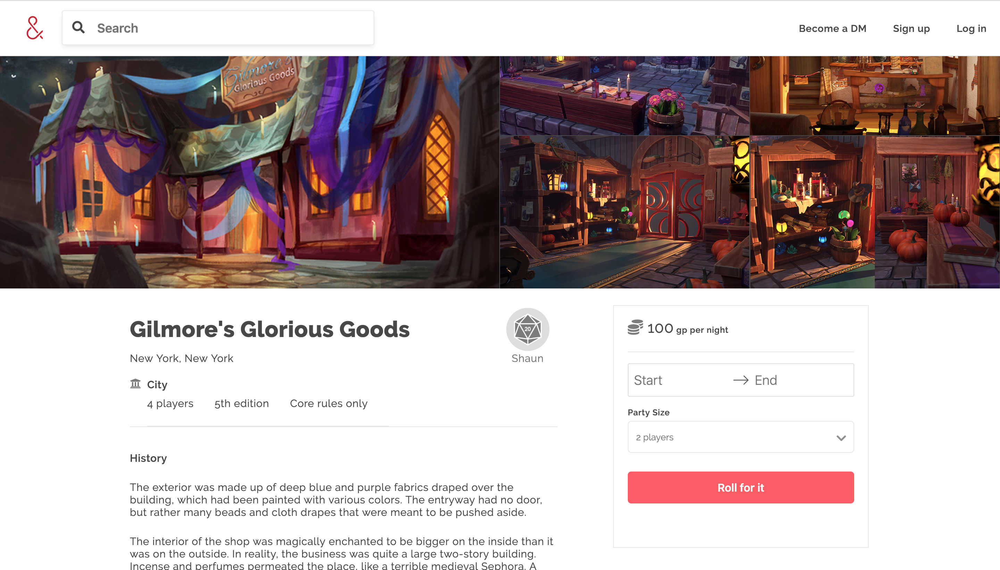
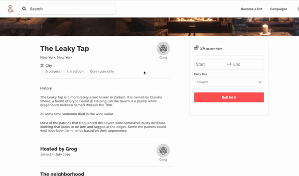
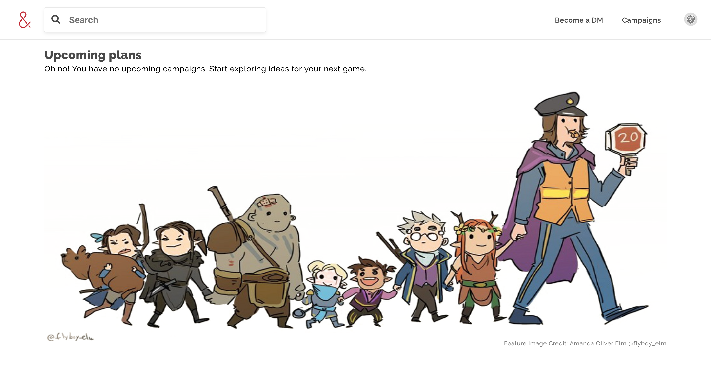
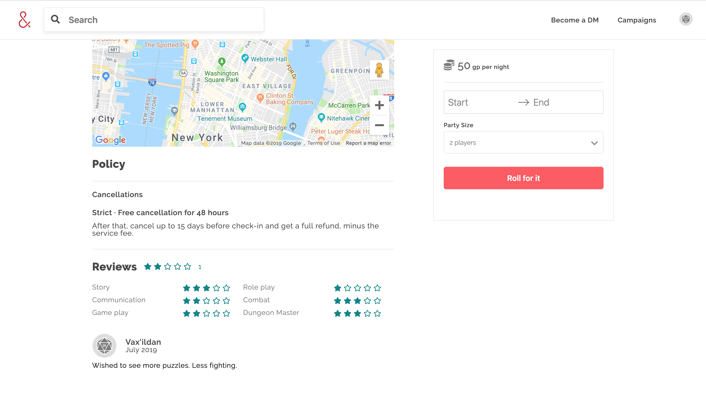
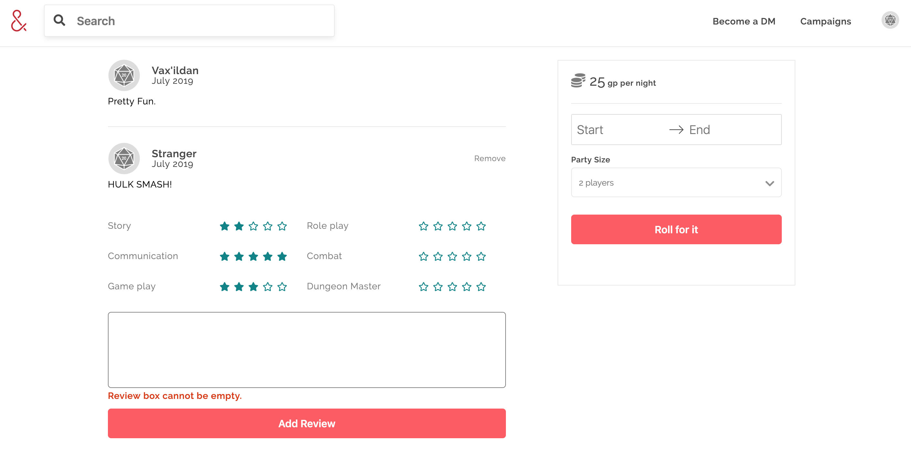

Where D&D players can search and book campaigns in their area. 

[Live Demo](https://air-d-n-d.herokuapp.com/#/) | Inspired by AirBnB


## Technologies
* JavaScript
* React / Redux
* Ruby on Rails
* PostgreSQL
* CSS
* Webpack
* Amazon Web Services
* Google Map API

## Features
### User Authentication

User Authentication is not needed to browse and search AirD&D's listings. However, features such as booking a campaign will require a user to either "Sign Up" or "Login"



Features and pages that are unavailiable to users who are not "logged in" will be redirected to another path if such conditions are met. 

```
const Protected = ({ component: Component, path, loggedIn, exact }) => (
<Route path={path} exact={exact} render={(props) => (
    loggedIn ? (
    <Component {...props} />
    ) : (
        <Redirect to="/listings" />
    )
)} />
);
```
```
const App = () => {
    return (
        <div className="main">
            <Modal />
            <Switch>
                <ProtectedRoute path="/campaigns" component={Trips} />
                <ProtectedRoute path="/listings/:id/payment/:type" component={Payment} />
                <Route path="/search/:type" component={Filtered}/>
                <Route path="/search" component={Filtered}/>
                <Route path="/listings/:id" component={Show} />
                <Route path="/listings" component={Landing}/>
                <Route exact path ="/" component={Splash}/>
            </Switch>
        </div>
    );
};
```
### Campaign Listings

Users can view the listings' splash page by simply clicking on the home page (Upper left corner). They can also filter the listings through the search bar or map. The Map utilizes Google Map API, which allows ther users to interactively filter out results base on the bounds of the map. 


```
registerListeners(){
    google.maps.event.addListener(this.map, "idle", () =>{
        const bounds = this.map.getBounds();
        const northEast = bounds.getNorthEast();
        const southWest = bounds.getSouthWest();
        const newBounds = {
            northEast: { lat: northEast.lat(), lng: northEast.lng() },
            southWest: { lat: southWest.lat(), lng: southWest.lng() },
        }
        this.props.changeFilter("bounds", newBounds);
    });
}
```
```
def index
    if (bounds && params[:searchFilter] || params[:searchFilter])
        new_list = Listing.in_bounds(bounds).where("UPPER(listings.location_type) LIKE :query OR UPPER(listings.city) LIKE :query OR UPPER(listings.title) LIKE :query", query: "%#{params[:searchFilter].upcase}%").includes(:reviews)
        new_list = new_list.uniq
    elsif bounds
        new_list = Listing.includes(:reviews).in_bounds(bounds)
    else
        new_list = Listing.all.includes(:reviews)
    end
    @listings = new_list
end
```
Users can also view each campaign description, rules, and perks. 



### Booking

Once a user is "logged in" they can book campaigns and view all their booked campaigns. The Booking form utilizes the [React-Dates](https://github.com/airbnb/react-dates) Library to display an interactive Calendar for booking. 



Clicking on the Campaign tab will display the user's Booking Index. Depending on whether or not the user have booked any campaigns, different pages will be shown.



```
render(){
    const { bookings, listings } = this.props;
    const { deleteBooking } = this.props;
    let books = (
        <>
            <p>Oh no! You have no upcoming campaigns. Start exploring ideas for your next game.</p>
            
            <p className="booking-notfound-p">Feature Image Credit: Amanda Oliver Elm  @flyboy_elm</p>
        </>
    )
    if (bookings instanceof Object && Object.values(bookings).length){
        books = Object.values(bookings).map( book => {
            return (
                <BookingIndexItem key={book.id} booking={book} listing={listings[book.listing_id]} deleteBooking={deleteBooking}/>
            )
        });
    }
    return(
        <section className="book-page">
            <div className="book-index-items">
                <h1>Upcoming plans</h1>
                {books}
            </div>
        </section>
    )
}
```
### Reviews

Unlike most rating features which have only (1) rating column, this application has multiple rating columns and an overall rating system (similiar to Airbnb). When adding a review, users are asked to select ratings for 6 different categories. An overall average rating will then be calulated on submit. 



```
def create
    @review = Review.new(review_params)
    @review.author_id = current_user.id
    @review.listing_id = params[:review][:listing_id]

    avg_rating = [
        @review.communication, 
        @review.gameplay,
        @review.story,
        @review.roleplay,
        @review.combat,
        @review.dm].sum / 5
    
    @review.rating = avg_rating

    if @review.save
        render json: @review
    else
        render @review.errors.full_messages, status: 422
    end
end
```
Also users can only review on campaigns if they have booked that particular campaign before and the date has passed. 



## Future Features
* Edit Bookings
* User Show Page
* Host Campaigns
* Save Campaigns
* Messaging
